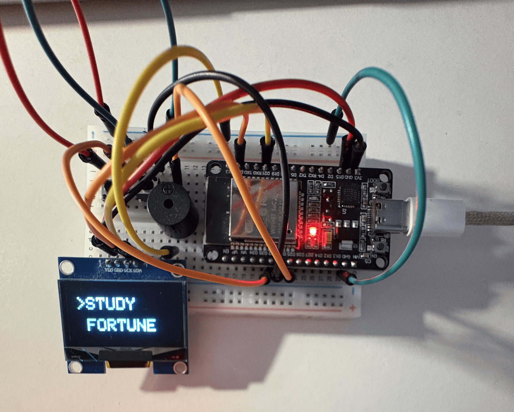
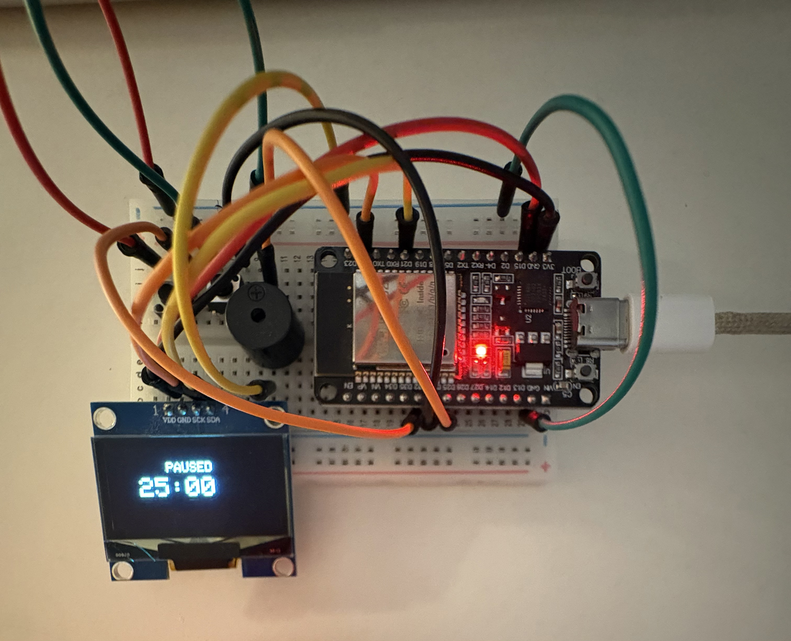
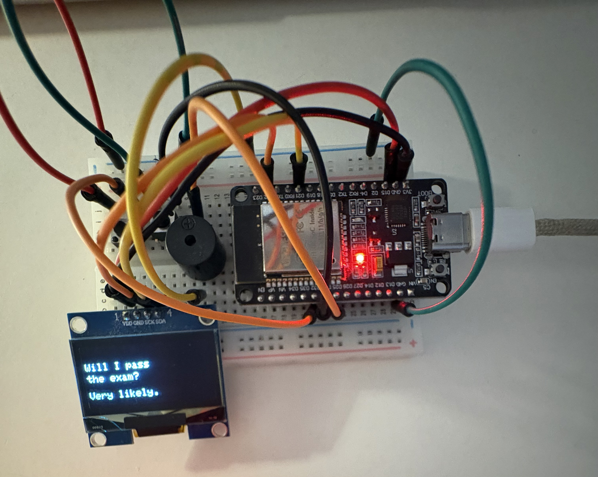

# ⏱️ Companion Study Timer

<p align="center">
  
</p>

<p align="center">
  <strong>An ESP32-powered Pomodoro timer with BLE control and a fun fortune generator.</strong>
</p>

---

## 🌟 Summary

Companion Study Timer is a compact ESP32-based Pomodoro device built with a 1.3-inch SH1106 OLED display. It combines a study countdown, a random exam fortune screen, Bluetooth Low Energy timer control, and an audible alarm in a simple two-button interface.

This project is part of my personal robotics development journey towards building an AI-based robotic companion.

---

## 📸 Project Preview

<p align="center">
  
  
</p>

<p align="center">
  <em>Study Timer mode (left) and Fortune Generator mode (right).</em>
</p>

---

## ✨ Features

- 25-minute Pomodoro timer by default
- Start, pause, resume, and restart controls
- `STUDY`, `PAUSED`, and `DONE!` timer states
- Three-beep alarm when a study session finishes
- Random exam fortune generator
- BLE timer configuration from 1 to 60 minutes
- Two-button menu designed for a 128×64 OLED display

---

## 🛠️ Hardware Used

- ESP32 Development Board
- 1.3-inch SH1106 OLED Display (128×64, I2C)
- 2 Push Buttons
- Active Buzzer
- Breadboard
- Jumper Wires
- USB Cable

---

## 🔌 Wiring

### OLED Display

| OLED Pin | ESP32 Pin |
|----------|-----------|
| VCC | 3.3V |
| GND | GND |
| SCL | GPIO 22 |
| SDA | GPIO 21 |

### Push Buttons

| Button | ESP32 Pin | Function |
|--------|-----------|----------|
| Left | GPIO 32 | Change selection / Return |
| OK | GPIO 33 | Confirm / Start / Pause |

Both buttons are connected between the GPIO pin and **GND**. The sketch uses `INPUT_PULLUP`, so no external pull-up resistor is required.

### Active Buzzer

| Buzzer Pin | ESP32 Pin |
|------------|-----------|
| + | GPIO 25 |
| - | GND |

---

## 📚 Required Libraries

Install using the Arduino IDE Library Manager:

- Adafruit GFX Library
- Adafruit SH110X
- ESP32 BLE Arduino

Also install:

- ESP32 by Espressif Systems (Boards Manager)

---

## 🚀 Installation

1. Assemble the hardware.
2. Open the Arduino sketch.
3. Select your ESP32 board.
4. Select the correct serial port.
5. Upload the sketch.
6. Enjoy your Companion Study Timer!

---

## 🎮 Controls

### Main Menu

- **Left Button:** Switch between `STUDY` and `FORTUNE`
- **OK Button:** Open selected menu

### Study Timer

- **OK:** Start / Pause / Resume
- **Left:** Reset and return to menu

### Fortune Screen

- **OK:** Generate a new fortune
- **Left:** Return to menu

---

## 📶 BLE Timer Control

Device Name:

```text
PomodoroESP32
```

| Type | UUID |
|------|------|
| Service | `1234` |
| Characteristic | `5678` |

Write a number between **1–60** to the characteristic to automatically start a timer with that duration.

---

## 🖥️ Display Modes

- 📋 Main Menu
- ⏱️ Study Timer
- ⏸️ Paused
- ✅ Done
- 🔮 Fortune Generator

---

## 💡 Future Improvements

- Automatic Pomodoro work/break cycles
- Save settings using EEPROM
- Better button debouncing
- Mobile application for BLE control
- Battery-powered portable version
- AI companion integration

---

## 👨‍💻 Author

**Dilan Tok**

Computer Science & Artificial Intelligence Student  
University of Sussex

GitHub: https://github.com/dilantok