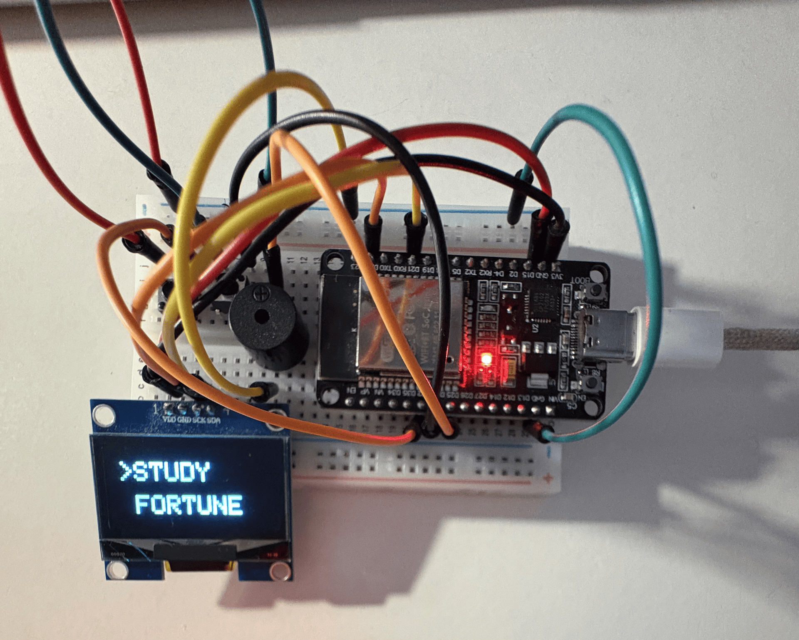
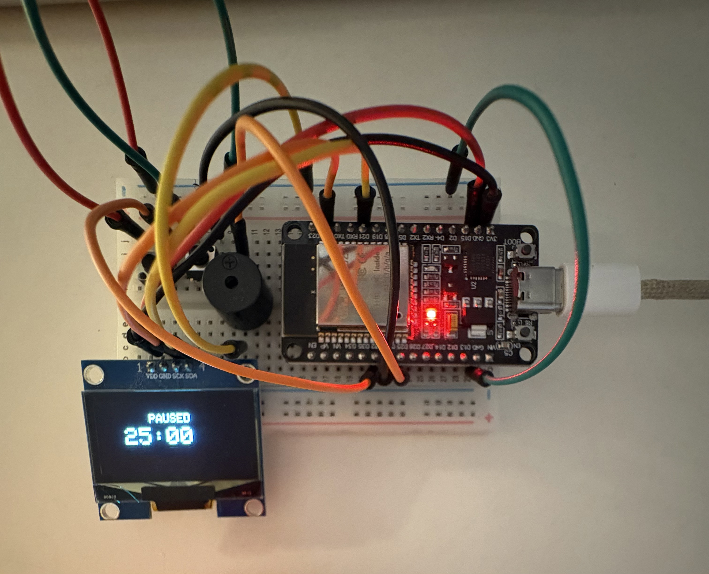
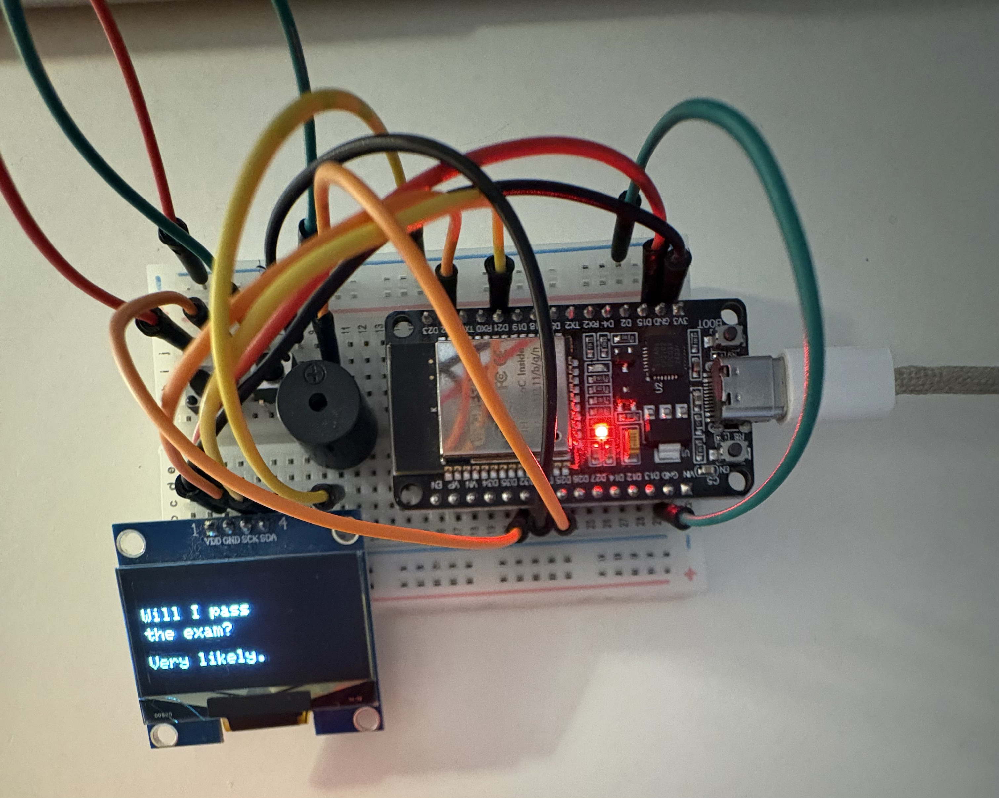

# Companion Study Timer

<p align="center">
  
</p>

An ESP32-powered Pomodoro timer with a two-button interface, Bluetooth Low Energy configuration, an OLED display, a completion alarm, and a light-hearted exam fortune generator.

I built this personal project to explore embedded C++, hardware and software integration, event-driven input, and wireless communication while creating a study tool I could use away from my laptop.

## What it does

- Runs a 25-minute study timer by default
- Starts, pauses, resumes, resets, and restarts sessions
- Shows clear `STUDY`, `PAUSED`, and `DONE!` states
- Plays a short melody when a session finishes
- Accepts custom durations from 1 to 60 minutes over BLE
- Generates random exam fortunes from a separate screen
- Debounces both physical buttons without blocking the main loop

<p align="center">
  
  
</p>

## Design

The firmware uses a small state machine with three application screens: menu, timer, and fortune. Each responsibility is isolated so that the main sketch coordinates components instead of containing every implementation detail.

| Component | Responsibility |
| --- | --- |
| `StudyCompanionTimer.ino` | Application setup, screen transitions, and event coordination |
| `TimerController` | Timer state, elapsed time, pausing, restarting, and completion detection |
| `DisplayView` | OLED initialization and rendering |
| `BleTimerService` | BLE setup, input validation, and passing duration requests to the main loop |
| `Button` | Debounced, edge-triggered button input |
| `FortuneGenerator` | Random fortune selection |
| `Alarm` | Buzzer initialization and completion melody |
| `Config` | Hardware pins, timing limits, and BLE identifiers |

The countdown is based on `millis()` rather than a one-second delay. BLE callbacks queue valid duration requests, then the main loop applies them. This keeps timer state changes in one place and avoids updating the user interface directly from the BLE callback.

## Hardware

- ESP32 development board
- 1.3-inch SH1106 OLED display, 128 x 64, I2C
- Two push buttons
- Piezo buzzer
- Breadboard and jumper wires
- USB cable

## Wiring

### OLED display

| OLED pin | ESP32 connection |
| --- | --- |
| VCC | 3.3V |
| GND | GND |
| SCL | GPIO 22 |
| SDA | GPIO 21 |

### Controls and buzzer

| Component | ESP32 connection | Purpose |
| --- | --- | --- |
| Left button | GPIO 32 to GND | Change selection or return |
| OK button | GPIO 33 to GND | Confirm, start, or pause |
| Buzzer positive | GPIO 25 | Completion melody |
| Buzzer negative | GND | Ground |

The buttons use the ESP32's internal pull-up resistors, so no external pull-up resistors are required.

## Build and upload

### Requirements

- Arduino IDE 2.x
- ESP32 by Espressif Systems, installed through Boards Manager
- Adafruit GFX Library
- Adafruit SH110X

The BLE classes are provided by the ESP32 Arduino core.

### Steps

1. Clone or download this repository.
2. Open `firmware/StudyCompanionTimer/StudyCompanionTimer.ino` in Arduino IDE.
3. Select the appropriate ESP32 board and serial port.
4. Install the required Adafruit libraries through Library Manager.
5. Verify and upload the sketch.

## Controls

| Screen | Left button | OK button |
| --- | --- | --- |
| Main menu | Switch between `STUDY` and `FORTUNE` | Open selection |
| Study timer | Reset and return to menu | Start, pause, resume, or restart |
| Fortune | Return to menu | Generate another fortune |

## BLE timer control

The ESP32 advertises as `PomodoroESP32`.

| Type | UUID |
| --- | --- |
| Service | `1234` |
| Writable characteristic | `5678` |

Using a BLE client, write a whole number from `1` to `60` to the characteristic. A valid value changes the duration, opens the timer screen, and starts the countdown immediately. Invalid or out-of-range values are ignored.

## Repository structure

```text
.
├── assets/
│   ├── companiongif.gif
│   ├── fortune.jpg
│   └── timepaused.jpg
├── firmware/
│   └── StudyCompanionTimer/
│       ├── StudyCompanionTimer.ino
│       ├── Alarm.h / Alarm.cpp
│       ├── BleTimerService.h / BleTimerService.cpp
│       ├── Button.h / Button.cpp
│       ├── DisplayView.h / DisplayView.cpp
│       ├── FortuneGenerator.h / FortuneGenerator.cpp
│       ├── TimerController.h / TimerController.cpp
│       ├── AppScreen.h
│       └── Config.h
└── README.md
```

## Author and contribution

Designed, wired, and programmed by **Dilan Tok** as an individual project.

Computer Science and Artificial Intelligence student at the University of Sussex

[GitHub profile](https://github.com/dilantok)
